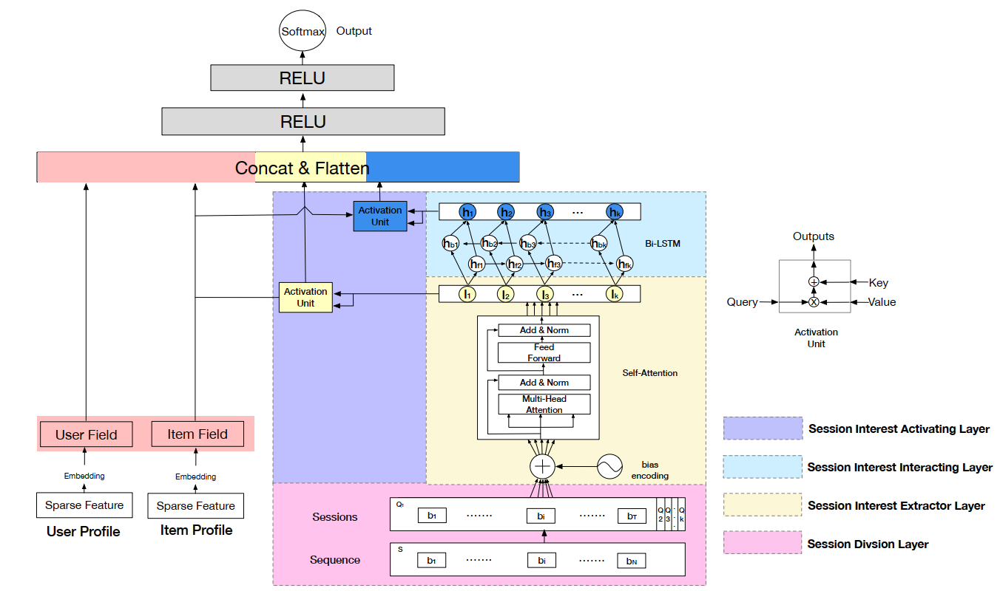

# DSIN模型

**[AI Studio项目](https://aistudio.baidu.com/aistudio/projectdetail/3770523)**

以下是本例的简要目录结构及说明： 

```
├── Ali_Display_Ad_Click_DSIN
    ├── big_test
    ├── big_train
    ├── download.sh
    ├── get_data.sh
    ├── readme.md
    ├── unzip.sh
├── readme.md #文档
├── config.yaml # sample数据配置
├── config_bigdata.yaml # 全量数据配置
├── net.py # 模型核心组网（动静统一）
├── dsin_reader.py # 数据读取程序
├── train_dsin.py # 模型训练程序
```

## 内容

- [DSIN模型](#dsin模型)
  - [内容](#内容)
  - [模型简介](#模型简介)
  - [数据准备](#数据准备)
  - [运行环境](#运行环境)
  - [模型组网](#模型组网)
  - [效果复现](#效果复现)
  - [进阶使用](#进阶使用)
  - [FAQ](#faq)

## 模型简介
模型主要聚焦于用户的历史会话行为，通过Self-Attention和BiLSTM对历史会话行为进行学习，最后通过Activation Unit得到最终的session表征向量，再结合其他特征送入MLP计算最后的ctr score。[Deep Session Interest Network for Click-Through Rate Prediction](https://arxiv.org/pdf/1905.06482v1.pdf)文章通过 Transformer 和 BiLSTM 来学习用户的 Session Interest Interacting，提升模型的表达能力。

## 数据准备
本模型使用论文中的数据集Alimama Dataset，参考[原文作者的数据预处理过程](https://github.com/shenweichen/DSIN/tree/master/code)对数据进行处理。

## 运行环境
PaddlePaddle == 2.2.2

python 3.7.4

os : windows/linux/macos 

## 模型组网
论文[Deep Session Interest Network for Click-Through Rate Prediction](https://arxiv.org/pdf/1905.06482v1.pdf)中的网络结构如图所示:  
<p align="center">

<p>

## 效果复现 

| 模型 | auc | batch_size | epoch_num | Time of each epoch |
| :------| :------ | :------ | :------| :------ | 
| DSIN | 0.6334 | 4096 | 3 | 约10分钟 |

效果复现过程可参考[AI Studio项目](https://aistudio.baidu.com/aistudio/projectdetail/3770523)。

Note:运行环境为至尊GPU。

## 进阶使用
  
## FAQ
